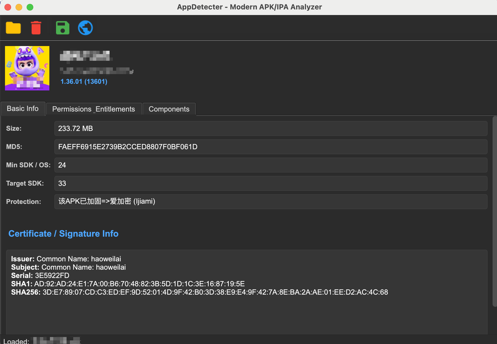
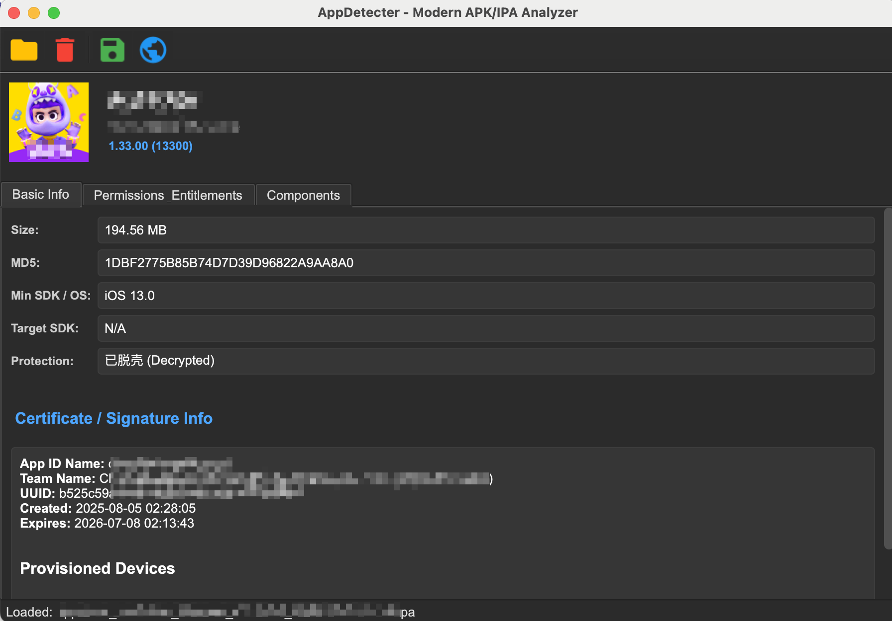
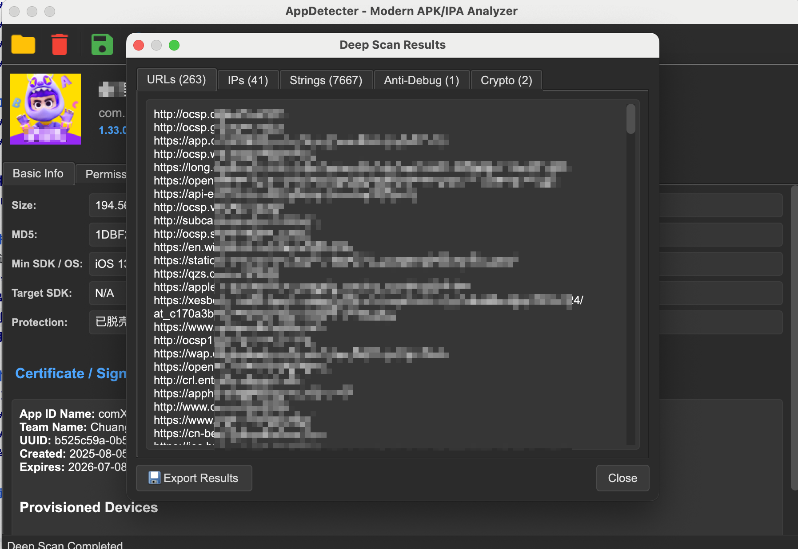

# ApkDetecter - 现代化 APK/IPA 分析工具

ApkDetecter 是一款功能强大的跨平台工具，专为分析 Android (APK) 和 iOS (IPA) 应用程序而设计。它提供了一个现代化的图形界面，用于查看应用信息、检查是否加壳，并对敏感数据进行深度扫描。

## ✨ 主要功能

### 📱 Android (APK) 分析
- **基本信息**：应用名称、包名、版本号/版本名、最小/目标 SDK 版本、是否加固。
- **组件列表**：列出 Activity、Service、Receiver 和 Provider。
- **权限分析**：详细列出应用申请的所有权限。
- **安全检查**：检测应用签名状态、是否可调试 (Debuggable) 等。



### 🍎 iOS (IPA) 分析
- **基本信息**：应用名称、Bundle ID、版本号、最低系统要求、支持的平台。
- **安全检查**：
  - **壳检测 (Cryptid)**：检测二进制文件是否经过加密（AppStore 正版）或已脱壳（破解版/调试版）。
  - **描述文件 (Provisioning Profile)**：解析嵌入的 mobileprovision 文件（Team ID、UUID、过期时间、权限 entitlement 等）。
- **URL Schemes**：提取已注册的 URL Schemes。



### 🔍 深度扫描 (Deep Scan)
对应用程序的二进制代码（Android 的 DEX，iOS 的 Mach-O）进行全面扫描，挖掘潜在风险：
- **URL & IP**：提取硬编码的 URL 链接和 IP 地址。
- **敏感字符串**：检测密钥（AWS, Google 等）、密码以及可疑关键词（如 root, su, vpn 等）。
- **反调试检测**：识别反调试技术（例如 `ptrace`, `sysctl`, `isDebuggerConnected`）。
- **加密库使用**：检测加密库和 API 的调用情况（例如 `AES`, `RSA`, `CommonCrypto`）。



### 🛠 其他特性
- **现代化 GUI**：基于 PyQt5 构建的暗色主题界面，简洁美观。
- **拖拽支持**：只需将 APK 或 IPA 文件拖入窗口即可开始分析。
- **报告导出**：支持将基本分析数据导出为 JSON 格式。
- **深度扫描导出**：支持将深度扫描结果导出为包含分类文本报告的 ZIP 压缩包。

## 🚀 安装指南

### 环境要求
- Python 3.8 或更高版本
- pip (Python 包管理器)

### 安装步骤
1. 克隆项目仓库：
   ```bash
   git clone https://github.com/yourusername/ApkDetecter.git
   cd ApkDetecter
   ```

2. 安装依赖库：
   ```bash
   pip install -r requirements.txt
   ```

   *注意：核心功能依赖于 `androguard` 和 `asn1crypto` 等库。*

## 💻 使用说明

1. **启动程序**：
   ```bash
   python ApkDetecter.py
   ```

2. **加载应用**：
   - **拖拽**：直接将 `.apk` 或 `.ipa` 文件拖放到主窗口中。
   - **菜单**：点击菜单栏的 `File -> Open` 选择文件。

3. **查看基本信息**：
   - 加载完成后，主界面会立即显示应用图标、版本信息和安全状态概览。

4. **执行深度扫描**：
   - 点击工具栏上的 **Deep Scan** 按钮（芯片图标）。
   - 等待扫描完成（界面会有进度条覆盖层提示）。
   - 扫描结束后，会在弹出的对话框中分类展示结果（URLs, IPs, Strings, Anti-Debug, Crypto）。

5. **导出结果**：
   - **基本报告**：点击工具栏的 **Export** 按钮，将应用元数据保存为 JSON 文件。
   - **深度扫描报告**：在 Deep Scan 结果对话框中，点击左下角的 **Export Results** 按钮，将所有扫描结果打包导出为 ZIP 文件。

## 📦 构建指南

### 前置要求
- 安装 Python 3.8+
- 安装 `pip`

### macOS 构建
1. 在项目目录中打开终端。
2. 安装依赖：
   ```bash
   pip install -r requirements.txt
   pip install pyinstaller
   ```
3. 运行构建命令：
   ```bash
    build_mac.sh
   ```
4. 应用程序 `ApkDetecter.app` 将位于 `dist` 文件夹中。

### Windows 构建
1. 在项目目录中打开命令提示符 (Command Prompt) 或 PowerShell。
2. 安装依赖：
   ```bash
   pip install -r requirements.txt
   pip install pyinstaller
   ```
3. 运行构建脚本：
   ```cmd
   build_windows.bat
   ```

4. 可执行文件 `ApkDetecter.exe` 将位于 `dist\ApkDetecter` 文件夹中。

## 📂 项目结构

- `Core/`: 核心分析逻辑 (`ApkAnalyzer.py`, `IpaAnalyzer.py`, `DeepScanner.py`)。
- `GUI/`: 用户界面组件 (`MainForm.py`, `AppInfoWidget.py`)。
- `Resources/`: 图标和资源文件。
- `libs/`: 包含的第三方依赖库（androguard）。

